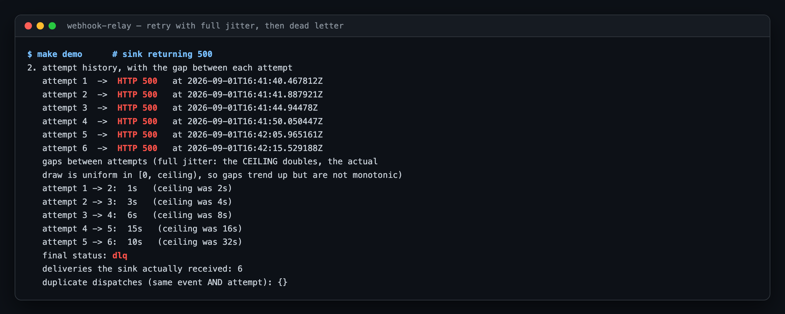
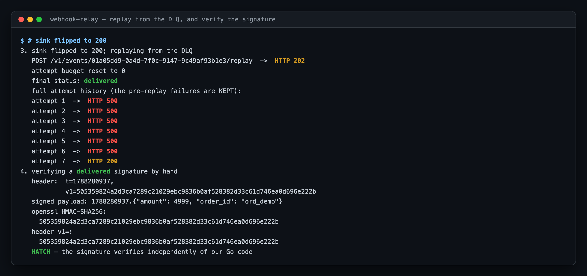
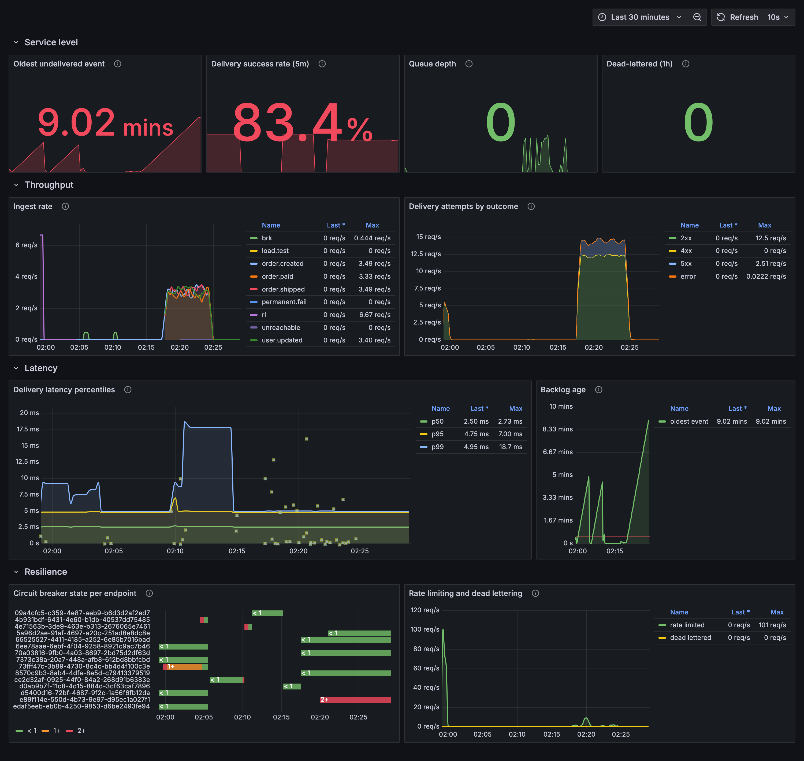
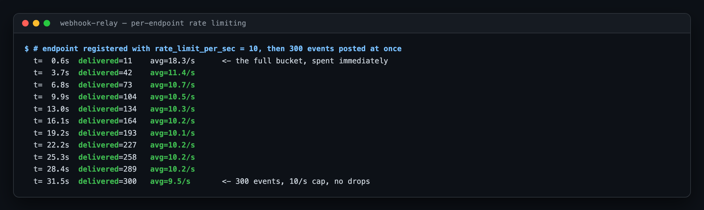
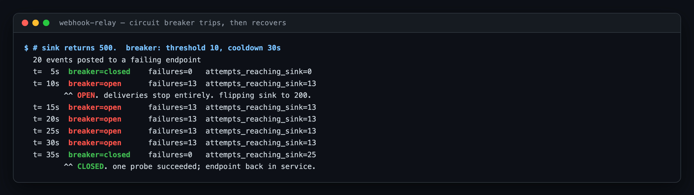
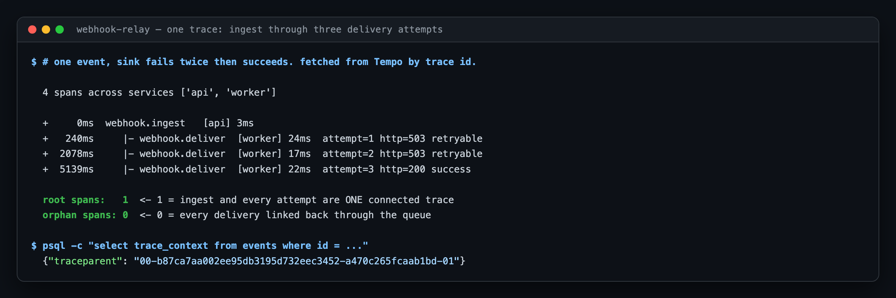
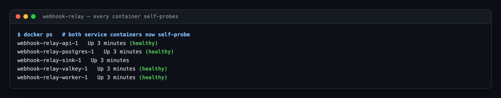

# webhook-relay

Reliable webhook delivery with at-least-once semantics, retries, and chaos-tested
failure modes — the kind of service Stripe or Svix runs internally.

[](https://github.com/singha105/webhook-relay/actions/workflows/ci.yml)
[](https://go.dev)
[](LICENSE)

---

## Status: Day 4 of 6

This repository is being built in public, one day at a time. **Only what is
described below actually works.** Nothing here is a stub presented as finished.

| | |
|---|---|
| ✅ **Working today** | Everything from Days 1–3, plus a k3d cluster from a committed config, Terraform-provisioned infrastructure, a Helm chart, GitOps delivery with ArgoCD, signed images with SBOMs, NetworkPolicies, alert rules, and an on-call runbook |
| ⬜ **Not built yet** | Chaos experiments (Day 5); k6 load test and the postmortem (Day 6). |

The roadmap is at the [bottom of this file](#roadmap).

---

## Quick start

Requires only **Docker** and **make**. Everything else runs in containers.

```bash
git clone https://github.com/singha105/webhook-relay.git
cd webhook-relay
make up && make migrate-up
```


`make up` refuses to start if a host port is already taken, and tells you which
one and how to override it — ports live in `.env` (see `.env.example`). That is
deliberate: on the machine this was built on, 8080 belonged to Apache and 5432
to a local Postgres, and a bind error from inside Docker is a bad way to learn
that.

Then seed some data:

```bash
make seed
```

To watch delivery actually happen — retries, dead-lettering, replay, and a
signature verified against `openssl` — start the stack with a controllable
receiver and run the demonstration:

```bash
make demo-up && make demo
```

**Grafana is at [localhost:3000](http://localhost:3000)** with the dashboard
already loaded — no login, no datasource wiring, no import step.

### On Kubernetes

Docker Compose is the fast path. The real deployment target is a Kubernetes
cluster, provisioned entirely by code:

```bash
make cluster-up      # k3d, from deploy/k3d/cluster.yaml
make bootstrap       # Terraform provisions everything into it
make endpoints       # prints URLs and generated passwords
```

`make cluster-up PROFILE=lowmem` uses a 1-agent profile if Docker has under
~5 GiB. See [Resource requirements](#resource-requirements).

<details>
<summary><code>make</code> targets</summary>

| Target | What it does |
|---|---|
| `up` / `down` | Start / tear down the stack (`down` also deletes volumes) |
| `migrate-up` / `migrate-down` | Apply / roll back migrations |
| `seed` | Register a demo endpoint and post a few events |
| `test` / `test-short` | Full suite (needs Docker) / unit tests only |
| `lint` / `fmt` / `vet` | golangci-lint, formatting, vet |
| `verify` | Everything CI runs |
| `scan` | Scan the whole git history for secrets |

</details>

---

## What it does today

### Register an endpoint

The signing secret is generated server-side and returned **exactly once**. It is
never included in any subsequent response.


The secret is stored in plaintext rather than hashed, because the delivery
worker has to recompute an HMAC over the payload at send time. Unlike a
password, it cannot be a one-way hash. "Shown once" is an API-surface guarantee,
enforced by the response shape and asserted by tests — not a storage guarantee.

### Ingest an event

Ingest does four things and no more: decode, validate, write one row, return.
No delivery work, no queue publish, no pre-flight lookup on the request path.


`202`, not `201` — the event is durably recorded, but nothing has been
delivered. Claiming `201 Created` would imply the work is done.

### Idempotent ingest

Replay the same `Idempotency-Key` and you get the original event back with a
`200` instead of a `202`. Ten concurrent identical requests produce exactly one
row.


This is resolved by the database, not the application. See
[the idempotency race](#the-idempotency-race) below.

### Deliver it, retry it, dead-letter it

A worker signs the payload, POSTs it, and records every attempt. When the
endpoint keeps failing, retries back off with full jitter until the attempt
budget is spent and the event is dead-lettered.



Look at the gaps rather than the timestamps. The **ceiling** doubles — 2s, 4s,
8s, 16s, 32s — but each actual delay is a uniform draw from `[0, ceiling)`, so
the sequence trends upward without being monotonic. The 5→6 gap of 10s under a
32s ceiling is the jitter working, not a bug. A perfectly doubling sequence
would mean it was not.

Note also `duplicate dispatches: {}` — six attempts, six deliveries, no
attempt sent twice.

### Replay it, and verify the signature

Point the endpoint at something healthy and replay from the DLQ. The attempt
budget resets; the failure history does not disappear.



The last step recomputes the HMAC with `openssl` and compares it to the `v1=`
digest we sent. It matches, which means the signature scheme is verifiable by
anything that can compute an HMAC — not just by our own Go code.

### Watch it happen



Provisioned from [`deploy/grafana/dashboards/webhook-relay.json`](deploy/grafana/dashboards/webhook-relay.json)
— the JSON on disk is the source of truth, and UI edits are deliberately
overwritten on reload. The dashboard is code.

The scattered markers on the latency panel are **exemplars**. Each one links a
histogram observation to the trace that produced it, so a p99 spike is one click
from the request that caused it.

### Rate limiting, per endpoint

`rate_limit_per_sec` from Day 1 is now enforced. 300 events posted at once to an
endpoint configured for 10/s:



The first 11 go straight through — that is the token bucket starting full, which
avoids a cold-start penalty on the first event to any endpoint. After that it
converges on exactly the configured rate.

A rate-limited delivery **does not consume an attempt**. The receiver never saw
a request, so there is nothing to record and nothing that should count against
the retry budget. Without that rule, a customer using exactly the rate they
configured would eventually have their events dead-lettered for being slow.

### The circuit breaker



Note the middle rows: while the breaker is open, `attempts_reaching_sink` is
frozen at 13. Not slowed — stopped. That is the point.

`consecutive_failures` overshot the threshold of 10 and tripped at 13, because
ten worker goroutines were in flight when it crossed. The breaker permits that
overshoot; what it does not permit is a *probe* stampede, which is why the
half-open transition is a Lua script.

### One trace, from ingest to the third attempt



One root span, zero orphans, across two services. The offsets show the retry
backoff directly.

### Everything self-probes



The runtime image is distroless — no shell, no curl — so each binary probes
itself via `-healthcheck`. The API GETs its own `/readyz`; the worker, which
serves no HTTP, checks that Postgres and Valkey are both reachable using its
real configuration.

---

## API

| Method | Path | Returns |
|---|---|---|
| `POST` | `/v1/endpoints` | `201` + the signing secret, once |
| `GET` | `/v1/endpoints` | `200` list (no secrets) |
| `GET` | `/v1/endpoints/{id}` | `200` or `404` |
| `PATCH` | `/v1/endpoints/{id}` | `200`, only the fields you send |
| `DELETE` | `/v1/endpoints/{id}` | `204`, cascades to events and attempts |
| `POST` | `/v1/events` | `202` accepted, or `200` on an idempotent replay |
| `GET` | `/v1/events/{id}` | `200` status + full attempt history |
| `POST` | `/v1/events/{id}/replay` | `202` requeued with a fresh budget, or `409` if not terminal |
| `GET` | `/healthz` | liveness — touches no dependency |
| `GET` | `/readyz` | readiness — pings Postgres |

Every error uses one envelope, so a client writes one error handler:

```json
{
  "error": {
    "code": "validation_failed",
    "message": "the request body failed validation",
    "fields": [
      { "field": "url", "message": "must use http or https scheme" },
      { "field": "rate_limit_per_sec", "message": "must be between 1 and 1000" }
    ],
    "request_id": "b291971c-96e2-43f5-acf0-c44847eab9ce"
  }
}
```

Validation reports **every** broken field at once, so fixing a bad request does
not take one round trip per mistake. The `request_id` matches the one on every
log line for that request, and is echoed in the `X-Request-ID` response header.

---

## Design decisions

The parts worth arguing about, and what each one costs.

### The idempotency race

Ingest never does `SELECT`-then-`INSERT`. That pattern has a window between the
two statements where a concurrent request can insert the same key, and closing
it in application code needs a distributed lock nobody wants on the hot path.

Instead the `INSERT` runs unconditionally against a partial unique index and
Postgres arbitrates:

```sql
INSERT INTO events (id, endpoint_id, event_type, payload, idempotency_key)
VALUES ($1, $2, $3, $4, $5)
ON CONFLICT (endpoint_id, idempotency_key) WHERE idempotency_key IS NOT NULL
DO UPDATE SET idempotency_key = events.idempotency_key
RETURNING ...
```

`DO UPDATE`, not `DO NOTHING`, even though the update writes the key back to
itself. `DO NOTHING` returns zero rows on conflict, which forces a follow-up
`SELECT` that may run *before the winning transaction has committed* — the race
just moves one statement later. `DO UPDATE` takes the row lock, waits for the
winner, and hands back the surviving row.

**What it costs:** one dead tuple per duplicate, for vacuum to reclaim.

"Was it created?" is answered by comparing the returned ID to the UUIDv7 we
generated — the database can only return our ID if our insert was the one that
landed. That avoids the `xmax = 0` trick and its dependence on a system column.

### The transactional outbox

Ingest has to do two things — persist the event, and make it deliverable — and
they live in two systems with no transaction spanning them. Whichever order you
pick, a crash between them breaks something:

| Order | Crash in between |
|---|---|
| Enqueue, then insert | A message pointing at an event that does not exist. |
| Insert, then enqueue | An event nothing will ever deliver. **Silent loss** — nothing reports an error. |

The outbox removes the choice. **Ingest writes only to Postgres**, in one
transaction, and returns `202`. A separate relay is the queue's only producer,
and it derives what to enqueue from the durable rows. A crash can then only
cause a *duplicate* enqueue, never a lost event — and duplicates are already
inside the at-least-once contract.

**What it costs:** an event waits up to one relay poll (250ms by default)
before it is enqueued. That is the price of not lying about atomicity.

The relay claims with a **lease** rather than holding a transaction open across
the enqueue. The textbook version — `BEGIN`, `SELECT … FOR UPDATE SKIP LOCKED`,
`XADD`, `UPDATE`, `COMMIT` — holds Postgres row locks across a network round
trip to a different system. Under load that turns every Valkey hiccup into lock
contention and a Valkey timeout into a long transaction blocking vacuum.
Instead the claim and the lease happen in one statement; what happens if the
relay dies mid-batch is enumerated case by case in
[`ClaimDueEvents`](internal/store/delivery.go).

### Valkey Streams, not a LIST and not SKIP LOCKED

A stream with a consumer group is the only one of the three that can express
*"this worker is holding this job right now, and if it dies somebody else must
get it."*

- **Not a LIST.** `LPOP` hands the job over and forgets it. Kill that worker
  between the pop and the HTTP call — which is exactly what Day 5 does — and the
  job is gone with no record it existed. `BRPOPLPUSH` into per-worker processing
  lists gets partway, but recovery then means enumerating every worker's list
  and deciding which owners are still alive: a consumer group rebuilt by hand.
- **Not Postgres `SKIP LOCKED`**, though the relay itself uses it. Every polling
  worker would hold a connection for its whole transaction, bounding worker
  count by `max_connections`, and queue churn would land on the same disk as the
  durable event log.
- **Streams** keep a per-group pending-entries list. `XREADGROUP` moves an entry
  there under a named consumer until `XACK`; `XAUTOCLAIM` reassigns entries idle
  too long. That is the recovery primitive, not something we build.

**What we give up:** the pending list is memory-resident; there is no delayed
redelivery, so backoff lives in Postgres; and it is at-least-once, never
exactly-once.

### Two independent recovery paths

A worker can die holding a job. So can Valkey.

| Failure | Recovered by |
|---|---|
| Worker dies holding a claim | `XAUTOCLAIM` after `STALE_CLAIM_TIMEOUT` (60s) |
| Worker dies **and** Valkey loses the pending list | The Postgres lease expiring after `DELIVERY_LEASE` (5m) |

The second is the one people forget. `XAUTOCLAIM` cannot recover an entry from a
pending list that no longer exists — a restarted pod, a flushed database, a
recreated consumer group. Only a durable lease covers both together, which is
why `next_retry_at` doubles as a lease expiry while an event is `delivering`.

These timeouts have an ordering that must hold:

```
DELIVERY_TIMEOUT  <  STALE_CLAIM_TIMEOUT  <  DELIVERY_LEASE
```

Violate the first and a slow-but-healthy delivery gets reclaimed and duplicated
while still in flight. Violate the second and the relay requeues events the
workers still hold. **Both are validated at boot**, with an error naming the
consequence — this is not the kind of thing you want to diagnose from duplicate
deliveries under load.

### Full jitter, and why it beats fixed backoff

An endpoint goes down. Every in-flight event fails at the same instant. With a
fixed delay — or with plain exponential backoff — every one of them retries at
the same instant too. The herd stays synchronized: the endpoint recovers, takes
the entire backlog as one spike, falls over, and the next round is just as
synchronized as the last.

**Backoff without jitter does not spread load. It postpones a stampede and then
reproduces it**, with a longer gap between identical spikes.

Drawing uniformly from `[0, ceiling)` breaks the correlation on the first retry
round and keeps it broken, because every subsequent draw is independent.

**What it costs:** the mean delay is halved (`E[U(0,c)] = c/2`), so clients
retry sooner on average than the ceiling implies, and any individual sequence is
not monotonically increasing. "Equal jitter" (`c/2 + U(0, c/2)`) trades some
decorrelation for a tighter lower bound; full jitter wins here because the
synchronized-herd case is exactly what Day 5 will create on purpose.

The property is [tested directly](internal/delivery/backoff_test.go), not
asserted in a comment: a thousand delays are bucketed across the window, every
bucket must be occupied, and no bucket may hold an outsized share. Without
jitter, one bucket would hold all thousand.

### Delivery-side deduplication, and its honest limits

Before dispatching, a worker claims `delivery:{event_id}:{attempt}` with
`SETNX` and a TTL. If the key exists, another worker already sent this exact
attempt.

Keyed on the **pair**, not the event: retries are supposed to happen, and only a
redelivery of the *same attempt* is a duplicate.

**This narrows the window. It cannot close it.** The gap between claiming the
key and the request reaching the receiver is still unprotected, and reversing
the order just trades one failure for the other. There is no exactly-once across
a network boundary — which is why every delivery carries a stable
`X-Webhook-Id` and [`pkg/webhook`](pkg/webhook) tells receivers to deduplicate
on it.

It also **fails open**: if Valkey is unreachable, the delivery proceeds.
Refusing to deliver because the cache is down would convert a duplicate-delivery
risk into a no-delivery outage.

`DELIVERY_DEDUP_ENABLED=false` turns it off on purpose, so Day 5 can demonstrate
the duplicates it prevents. A safety control that is never observed failing is
indistinguishable from one that does nothing.

### Retry classification

| Response | Outcome | Why |
|---|---|---|
| `2xx` | Success | — |
| `408`, `429` | Retry | Both explicitly describe a condition that will pass. |
| Other `4xx` | **Permanent — straight to DLQ** | A 404 or a rejected signature will never succeed. Burning six attempts is wasted work for us, unwanted traffic for them, and it delays an operator noticing. |
| `5xx` | Retry | The server is saying it failed, not that we did. |
| `3xx` | Retry | We do not follow redirects, so this is a misconfigured receiver — one more chance beats dead-lettering on the first surprise. |
| Transport error | Retry | A refused connection is indistinguishable from a restarting endpoint. |

`Retry-After` is honoured on 429 and 503 in both RFC 9110 forms, clamped, and
combined with our own backoff by taking the **maximum** — so a receiver cannot
shorten our backoff by sending `Retry-After: 0`.

### Redirects are not followed

Beyond a `3xx` meaning a misconfigured receiver, following one would deliver a
signed payload to a host the customer never registered — an SSRF primitive
handed to whoever controls the original URL.

### UUIDv7 for event IDs

The leading 48 bits are a Unix millisecond timestamp, so IDs sort in creation
order. Primary-key inserts append at the right edge of the B-tree instead of
scattering random pages, and the PK doubles as a rough time index.

**What it costs:** an event ID leaks its creation time. For a webhook event that
is not sensitive; for a user-facing resource ID it might be.

### Indexes are argued for, individually

This is a write-heavy path, so every index is amplification paid on each insert.
All four are justified inline in [`migrations/000001_init.up.sql`](migrations/000001_init.up.sql),
along with three indexes deliberately *not* created and why.


The partial index on `(endpoint_id, created_at) WHERE status='pending'` is the
interesting one. The equality column leads so `created_at` supplies the
`ORDER BY` — the plan above has no `Sort` node, so `LIMIT` short-circuits it.
Being partial means the index tracks the size of the *backlog* rather than
lifetime event volume: a delivered event drops out of it entirely.

### Valkey Streams over a LIST — and over Postgres SKIP LOCKED

Day 1 ships `queue.Queue` as an interface with no implementation, because
nothing consumes events yet and there is no behaviour to get wrong. The
reasoning is recorded in [`internal/queue/queue.go`](internal/queue/queue.go):

- **Not a LIST**, because a `LPOP` hands the job to a worker that might die
  holding it, and the job is then simply gone. That breaks at-least-once, which
  is the entire promise of this service. Streams keep a pending-entries list per
  consumer group, so an unacknowledged job can be reclaimed with `XAUTOCLAIM`.
- **Not Postgres `SELECT ... FOR UPDATE SKIP LOCKED`**, though it is genuinely
  tempting — it would drop Valkey entirely and make enqueue transactional. It
  loses because polling burns a connection per worker per poll, and it puts
  queue depth on the same disk as the durable event log, which is the last thing
  we want to saturate under load.

Day 6's benchmark is the honest test of that call. The interface is the seam
that makes reversing it cheap.

### Migrations are an operator action

`make migrate-up` runs the official `golang-migrate` image as a compose service.
Migrations deliberately do **not** run at application startup: several replicas
racing to migrate during a rolling deploy is a well-known way to deadlock one.

The `.sql` files are the single source of truth shared with the integration
tests, so the two paths cannot drift.

### Liveness and readiness are not the same probe

They answer different questions, and Kubernetes does different things with the
answers.

| | Question | Failure action |
|---|---|---|
| `/healthz` | Is this process broken beyond recovery? | Container is **killed and restarted** |
| `/readyz` | Should traffic go here *right now*? | Pod is **removed from the Service**, keeps running |

**What breaks if you conflate them.** Point liveness at the database, then give
the database a thirty-second blip. Every replica fails liveness simultaneously
and Kubernetes kills all of them at once. That:

1. **Drops every in-flight request and delivery**, turning a recoverable
   dependency blip into real data-movement failures.
2. **Starts a crash loop.** The restarted pods still cannot reach the database,
   fail again, and get killed again — now with exponential backoff on restarts,
   so recovery is delayed well past the database's own.
3. **Destroys the evidence.** The logs and in-memory state of the pods that saw
   the failure are gone.

The failure mode is worst precisely when the dependency recovers: the database
comes back and, instead of the fleet resuming, it is midway through a
`CrashLoopBackOff` cycle keeping it down for minutes longer.

The reverse conflation — readiness that checks nothing — is quieter but also
wrong: a pod that cannot reach Postgres stays in the Service and returns errors
that a healthy replica could have served.

So: **liveness checks only that the process is running its own event loop.**
**Readiness checks the dependencies this process needs to do useful work.**

The two binaries deliberately differ:

- **API readiness** includes a backlog check. Shedding ingest while the workers
  catch up beats accepting events we already know we cannot deliver on time.
- **Worker readiness** deliberately does **not**. A worker with a deep backlog is
  the thing working on it; pulling it from the Service would only slow recovery.

### Rate limiting and the breaker both fail *open*

If Valkey is unreachable, deliveries proceed. Both are protections for the
receiver and optimizations for us — refusing every delivery because a cache is
down would convert a degraded dependency into a total outage. The failure is
logged, never silent.

### Two Lua scripts, for the same reason

Both the token bucket and the breaker's half-open transition are
read-modify-write against a key that every worker goroutine in every replica is
racing.

- **Token bucket:** two workers can both read "1 token left" and both proceed, so
  an endpoint configured for 10/s quietly receives 20. `WATCH`/`MULTI`/`EXEC`
  would be correct but degrades into a retry storm under exactly the contention
  that makes a limiter matter.
- **Half-open probe:** when the cooldown expires, every worker checks at once. If
  they all read "cooldown elapsed" they all probe — delivering the precise
  stampede the breaker exists to prevent, at the worst possible moment. `SET NX`
  on a probe key makes the winner unique.

Time inside the bucket script comes from `redis.call('TIME')`, not from the
caller: a worker whose clock runs two seconds fast would credit itself two extra
seconds of tokens on every call.

### Tracing across the outbox needs durable context

This is the part that is easy to get wrong, and it is not solvable with
in-process propagation.

The outbox decouples ingest from enqueue on purpose: ingest writes a row and
returns; a background relay picks that row up later. So by construction the
relay has **no in-memory link** to the request that created the event — it is a
different goroutine, usually a different process, running minutes later.

Passing `context.Context` around cannot bridge that. The W3C trace carrier has
to be as durable as the event, so it lives in `events.trace_context`
([migration 000004](migrations/000004_event_trace_context.up.sql)). The relay
rehydrates it when claiming, `Enqueue` injects it into the stream entry as
ordinary string fields, and the worker extracts it before starting its span.

Without it every delivery opens its own unconnected trace: you can see that an
ingest happened and that a delivery happened, with no way to tell they were the
same event — which is exactly the question you are asking when something is
wrong.

---

## Running on Kubernetes

Nothing below is applied by hand. `make bootstrap` runs Terraform, Terraform
installs ArgoCD, and ArgoCD deploys the application from this repository.

```
deploy/k3d/cluster.yaml      the cluster            <- committed, not typed flags
terraform/                   everything in it       <- terraform apply
deploy/charts/webhook-relay  the application        <- deployed BY ArgoCD, not Terraform
gitops/                      what ArgoCD watches
```

### Why Terraform stops at the cluster boundary

Terraform provisions infrastructure. ArgoCD deploys the application. The
obvious alternative — have Terraform install the app's chart too — is what most
people do, and it is worse in three specific ways:

| | Terraform deploys the app | ArgoCD deploys the app |
|---|---|---|
| Drift | Silent until the next apply, possibly weeks | Corrected in ~30s |
| Deploying a new image | Run Terraform from CI → **CI needs cluster credentials** | Commit a tag → CI needs nothing |
| Rollback | Revert and re-apply, with no record of what ran when | `argocd app rollback`, or `git revert` |

### Why pull-based delivery is more secure

This is the part worth being able to argue.

The push model — `kubectl apply` or `helm upgrade` from GitHub Actions —
requires a long-lived cluster credential stored in a third party's secret
store:

- **Any workflow in the repository can read it**, including one added by a pull
  request that modifies `.github/workflows`. That is a well-known escalation
  path.
- **The API server must accept inbound connections from GitHub's runner
  ranges**, so it is exposed to the internet rather than reachable only from
  inside the network.
- **A compromised runner has immediate, direct cluster access**, with no audit
  trail beyond logs the attacker can influence.

Pull inverts it. CI can only write to Git. ArgoCD, running *inside* the
cluster, reads from Git and applies:

- No cluster credential exists outside the cluster.
- The API server needs no inbound internet access at all.
- Every deployment is a commit — reviewable, attributable, revertible.
  `git log gitops/values.yaml` is the deployment history.
- A compromised runner can at worst commit a bad tag, which shows in the diff
  and is undone by `git revert`.

### The deployment path, end to end

```
merge to main
  → release.yml builds a multi-arch image
  → pushes to ghcr.io tagged sha-<12-char-sha>   (never :latest)
  → cosign signs it keylessly via the workflow's OIDC identity
  → Syft SBOM attached as a signed attestation
  → CI commits the new tag into gitops/values.yaml
  → ArgoCD notices the commit and syncs
  → Helm pre-upgrade hook runs migrations behind an advisory lock
  → new pods roll out
```

The image is never tagged `latest`. The chart **fails the render** if you try:

```
image.tag must be set to an immutable tag (a git SHA). 'latest' is refused:
it makes rollback impossible and lets two pods claiming one version run
different code.
```

### Signing and provenance

Cosign signs with **no key at all**. It exchanges the workflow's OIDC token for
a short-lived certificate from Fulcio and records the signature in the public
Rekor transparency log. There is no signing key to leak, and the certificate
binds the signature to *this workflow in this repository* — something a
checksum cannot express.

```bash
cosign verify \
  --certificate-identity-regexp '^https://github.com/singha105/webhook-relay/.github/workflows/release.yml@refs/heads/main$' \
  --certificate-oidc-issuer 'https://token.actions.githubusercontent.com' \
  ghcr.io/singha105/webhook-relay:sha-<sha>
```

The SBOM is attached as a signed attestation rather than an uploaded artifact,
so "what is in this image" is answerable from the image alone — which is what
matters at the moment a CVE lands and you need to know whether you are
affected.

### The SIGTERM ordering

Getting this wrong causes duplicate deliveries on every rollout, silently.

When a pod is deleted, **two things happen concurrently and Kubernetes does not
order them**: the kubelet sends `SIGTERM`, and the endpoints controller removes
the pod from the Service. The second is eventually consistent.

```
t=0     pod marked Terminating
        ├─ endpoint removal begins  (takes ~1-2s to propagate)
        └─ preStop sleep begins     ← holds the container open meanwhile
t=5s    preStop returns, SIGTERM delivered
t=5s    app stops claiming new work, finishes in-flight deliveries
t=?     app exits
t=45s   terminationGracePeriodSeconds expires → SIGKILL
```

Without the preStop delay, a process that exits promptly on `SIGTERM` is still
being routed to — the client sees connection refused, which on the ingest path
is a dropped event.

`terminationGracePeriodSeconds` is **computed**, not hand-set:
`preStopDelay + drainTimeout + 10s`. Hand-setting it is how you get a worker
SIGKILLed mid-delivery, leaving an unacked queue entry that is redelivered
later as a duplicate caused purely by a rollout.

The `preStop` uses the **native `sleep` action**, not `exec`. The image is
distroless — there is no shell and no `/bin/sleep`, so `exec: ["sh","-c","sleep 5"]`
would fail to start and the kubelet would go straight to `SIGTERM`, silently
removing the delay.

### Migrations, and the race they avoid

Migrations run as a Helm `pre-upgrade` hook, not an initContainer. An
initContainer runs once per pod — four replicas means four concurrent migration
attempts on every rollout.

The failure being prevented: two deploys overlapping (a rollback issued while a
rollout finishes, or ArgoCD retrying a failed sync) both read
`schema_migrations`, both see version N, both apply N+1. That is either a loud
duplicate-object error, or — worse — two `ALTER`s that both succeed and leave a
schema no migration file describes. golang-migrate takes a Postgres session
advisory lock, so the second process waits.

### NetworkPolicies

Default-deny, then enumerate. The asymmetry is the interesting part:

| | Postgres | Valkey | Internet |
|---|---|---|---|
| **API** | ✅ | ✅ | ❌ **denied** |
| **Worker** | ✅ | ✅ | ✅ except RFC1918 |

The API never makes an outbound call, so denying it egress means an SSRF in the
ingest path cannot become an outbound request — even though the API accepts
customer-supplied URLs at endpoint registration.

The worker *must* reach arbitrary addresses, so an allow-list is impossible.
What *is* possible is excluding `10/8`, `172.16/12`, `192.168/16` and
`169.254/16`, so a customer cannot register `http://10.0.0.1/` and use our
worker to scan the internal network. That closes the SSRF gap the Day 1 README
listed, at the network layer rather than with URL validation an attacker can
encode around.

> **Not enforced on this cluster.** k3s ships Flannel, which accepts
> NetworkPolicy objects and silently ignores them. Real enforcement needs
> Calico or Cilium. The policies are correct and committed; they are currently
> documentation.

### Secrets in Git

See **[docs/secrets.md](docs/secrets.md)** for the full argument. The summary:

- **Sealed Secrets** for anything ArgoCD deploys — a `SealedSecret` is a plain
  manifest, so ArgoCD needs no plugin, no sidecar, and no key.
- **SOPS + age** for values a human or a CI job needs, which a SealedSecret can
  never provide (it can only be decrypted by the controller).
- **Best of all: generate at provision time.** The Postgres and Grafana
  passwords are generated by Terraform and never enter Git in any form. That is
  strictly better than encrypting and committing, and it is available whenever
  the thing creating the cluster can also create the secret.

The trap: the Sealed Secrets private key lives in the cluster. Recreate the
cluster and every committed `SealedSecret` becomes undecryptable — ArgoCD syncs
green and no `Secret` ever appears. `make seal-backup` exports it.

### Resource requirements

| Profile | Docker memory | What you get |
|---|---|---|
| `full` | **~6 GiB** | 1 server + 2 agents, 3-replica Postgres with real failover, Loki, Chaos Mesh |
| `lowmem` | ~3.5 GiB | 1 server + 1 agent, single Postgres, no Loki, no Chaos Mesh, 6h metrics retention |

```bash
make cluster-up PROFILE=lowmem && make bootstrap PROFILE=lowmem
```

The full profile needs Docker Desktop → Settings → Resources → Memory ≥ 6 GiB.

---

## Service level objective

> **99% of events are delivered within 30 seconds of ingest, measured over a
> rolling 7 days.**

Three deliberate choices in that sentence:

- **From ingest, not from dequeue.** The customer's clock starts when they hand
  us the event. Measuring from when *we* got around to scheduling it would let
  us hide a backlog by not looking at it.
- **Delivered, not attempted.** A 5xx that is retried and eventually succeeds
  inside 30 seconds met the objective. The customer does not care how many
  attempts it took.
- **7 days, not 30.** Long enough that one bad afternoon does not dominate,
  short enough that the budget resets while the incident is still remembered.

### Measuring it

The SLI is the fraction of delivery attempts that succeeded, read from the
histogram's cumulative buckets rather than from a quantile — a quantile answers
"what is the value at rank p", which cannot tell you "what fraction met the
target".

```promql
# SLI: proportion of successful deliveries over the SLO window.
sum(rate(webhook_delivery_attempts_total{status_class="2xx"}[7d]))
/
sum(rate(webhook_delivery_attempts_total[7d]))
```

That covers "delivered". The "within 30 seconds" half is the backlog gauge,
because end-to-end latency is exactly how long the oldest undelivered event has
been waiting:

```promql
# Fraction of time the backlog stayed inside the 30s objective.
avg_over_time(
  (max(webhook_queue_oldest_message_age_seconds) < bool 30)[7d:1m]
)
```

Both are precomputed as [recording rules](deploy/observability/rules/webhook-relay.yml).
A panel and an alert that compute the SLO with slightly different expressions
will eventually disagree, and at that point nobody trusts either.

### The error budget

A 99% objective over 7 days permits **1% of events to miss the target**.

| | |
|---|---|
| Window | 7 days = 10,080 minutes |
| Objective | 99% |
| Error budget | 1% = **100.8 minutes** of total unavailability |
| At 100 events/s | 1% of ~60.5M events = **~604,800 events** may miss |

Budget *consumed* so far in the window:

```promql
# 0 = untouched, 1 = fully spent, >1 = objective missed.
(
  1 - (
    sum(rate(webhook_delivery_attempts_total{status_class="2xx"}[7d]))
    /
    sum(rate(webhook_delivery_attempts_total[7d]))
  )
) / 0.01
```

### Burn rate, and why the alert uses two windows

Burn rate is how fast the budget is being spent relative to sustainable. A burn
rate of 1 exhausts the budget exactly at the end of the window; a burn rate of
14.4 exhausts a 30-day budget in about two days.

```promql
# Fast burn: 14.4x sustainable, confirmed over both a short and a long window.
(
  (1 - webhook:delivery_success:ratio_rate5m) > (14.4 * 0.01)
  and
  (1 - webhook:delivery_success:ratio_rate1h) > (14.4 * 0.01)
)
```

The `and` across a 5-minute and a 1-hour window is the point. The short window
alone pages on a single bad minute; the long window alone takes an hour to
notice a total outage. Requiring both means the alert is **fast to fire and slow
to flap** — it needs the failure to be both sudden and sustained.

### What the budget is *for*

An error budget that is never spent means the objective is too loose, or too
much engineering is going into reliability that customers cannot perceive.
Budget remaining is permission to ship; budget exhausted is a signal to stop
shipping features and fix delivery. That is the entire reason to state a number
rather than "we try hard".

---

## Testing


Integration tests run against **real Postgres in a container** via
testcontainers-go. There are no database mocks, because most of what is worth
testing in the store layer *is* database behaviour — `CHECK` constraints,
`ON CONFLICT` arbitration, cascade deletes, and transaction visibility. A mock
would only assert that our fake behaves like our fake.

One container is shared per test binary; each test gets its own schema, so tests
run in parallel without seeing each other's rows.

### The pipeline is tested as a pipeline

Twelve integration tests in [`internal/worker`](internal/worker) run a complete
system — real Postgres, real Valkey, a real HTTP receiver, the relay, and the
worker pool, wired exactly as `cmd/worker` wires them. They cover success, retry
then success, permanent `4xx`, exhaustion into the DLQ, replay from the DLQ,
signature verification, header correctness, inactive endpoints, and the
consecutive-failure counter.

They earned their keep immediately by catching a real bug: `ReplayEvent` checked
for the pgx no-rows sentinel, but `scanEvent` had already normalized it to
`models.ErrNotFound` — so the check never matched, `ErrNotReplayable` was
unreachable, and the API would have answered `500` where it should answer `409`.

### The race test was verified by mutation

A concurrency test that passes proves nothing unless it can fail. Swapping the
`ON CONFLICT` insert for the naive `SELECT`-then-`INSERT` makes it fail exactly
as it should:

```
--- FAIL: TestCreateEventIdempotencyRace (1.52s)
    goroutine 0: CreateEvent() = create event: ERROR: duplicate key value
    violates unique constraint "events_endpoint_idempotency_key_uniq"
    (SQLSTATE 23505) (a lost race must not surface as an error)
```

Getting there required fixing the test itself. `pgxpool` opens connections
lazily, so the first goroutine off the line completed its whole transaction
while the others were still finishing TCP handshakes — they never overlapped,
and the test passed the broken implementation too. Both race tests now pre-warm
their connection pools before the starting gate opens.

---

## Layout

```
deploy/k3d/         cluster definition — committed, not typed flags
terraform/          cluster infrastructure: CNPG, Valkey, observability, ArgoCD
deploy/charts/      the Helm chart ArgoCD deploys
gitops/             app-of-apps; gitops/values.yaml is written by CI
docs/runbook.md     on-call procedures
docs/secrets.md     how secrets live in Git without being readable

cmd/api/            HTTP ingest + management API
cmd/worker/         outbox relay + delivery worker pool
internal/models/    domain types and validation; no I/O
internal/store/     Postgres access; owns every SQL statement
internal/queue/     Valkey Streams work queue
internal/relay/     transactional outbox: Postgres -> queue
internal/worker/    delivery pool, retry and DLQ decisions
internal/delivery/  HTTP client, backoff, classification, dedup
internal/httpapi/   routing, middleware, handlers
internal/config/    environment-only configuration
pkg/webhook/        PUBLIC: signature verification for receivers
migrations/         golang-migrate SQL, indexes justified inline
deploy/compose/     local stack: postgres 16, valkey 8, api, worker
test/               testcontainers helpers and the full-pipeline harness
test/sink/          controllable webhook receiver for tests and the demo
```

---

## Roadmap

| Day | Deliverable |
|---|---|
| **1** ✅ | Ingest API, schema, idempotency, local stack, CI |
| **2** ✅ | Outbox relay, Valkey Streams, delivery worker, HMAC signing, full-jitter retries, DLQ, replay |
| **3** ✅ | Rate limiting, circuit breaker, tracing, metrics, Grafana, graceful shutdown, SLO |
| **4** ✅ | k3d + Terraform + Helm + ArgoCD, signed images, NetworkPolicies, alerts, runbook |
| **5** | Chaos Mesh fault injection against all of it |
| **6** | k6 load test, benchmark numbers, and the postmortem |

`endpoints.consecutive_failures` is already maintained by the worker — reset on
success, incremented on failure — so Day 3's circuit breaker reads a counter
that is already correct rather than starting from zero against live data.

---

## Known gaps

Stated plainly rather than discovered by a reviewer:

- **No authentication.** Anyone who can reach the API can register endpoints and
  post events. Real deployments need API keys per tenant.
- **No SSRF protection.** Endpoint URLs may point at loopback and private
  ranges, which is required for local testing but would need an egress allowlist
  in a hosted deployment.
- **Delivery is at-least-once, deliberately.** The dedup guard narrows the
  duplicate window; it does not eliminate it. Receivers must deduplicate on
  `X-Webhook-Id`.
- **`endpoint_id` is a metric label.** That is one series per endpoint on four
  metrics. Fine for the tens of endpoints this targets, a cardinality problem at
  thousands. The breaker gauge is explicitly bounded at 500 series; the latency
  histogram deliberately omits the label entirely.
- **Grafana runs with anonymous admin access in the Compose stack.** Correct
  for a local demo where a login stands between `make up` and a working
  dashboard; not something to deploy. The Kubernetes deployment uses a
  generated password instead.
- **NetworkPolicies are written but not enforced**, because k3s ships Flannel.
  They need Calico or Cilium to do anything.
- **The HPA's queue-depth metric is disabled by default.** It needs
  prometheus-adapter, which is not installed; the CPU target still works. An
  HPA referencing a metric nobody serves is a silently degraded autoscaler,
  which is why it is off rather than aspirational.
- **The full profile needs ~6 GiB of Docker memory.** The `lowmem` profile
  fits in ~3.5 GiB but gives up Postgres failover, Loki, and Chaos Mesh.
- **Tracing samples at 100%.** Right at this volume and for a demonstration.
  Real traffic needs head or tail sampling.
- **The breaker can overshoot its threshold.** Ten concurrent goroutines can
  push `consecutive_failures` past 10 before the open takes effect. Deliberate:
  making the trip exact would need a lock on the hot path, and a few extra
  failed requests are cheaper than that. The *probe* is exact, which is the part
  that matters.
- **Offset pagination** on `GET /v1/endpoints` drifts under concurrent inserts.
  Acceptable because endpoints are registered by humans, not by traffic. The
  events table would need keyset pagination.

## License

[MIT](LICENSE)
