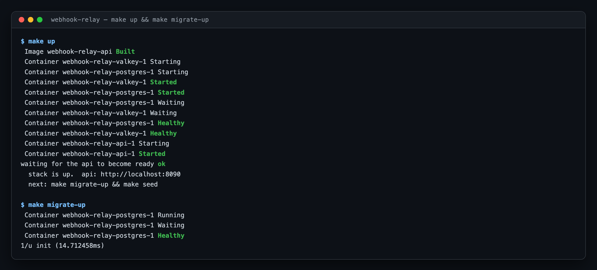
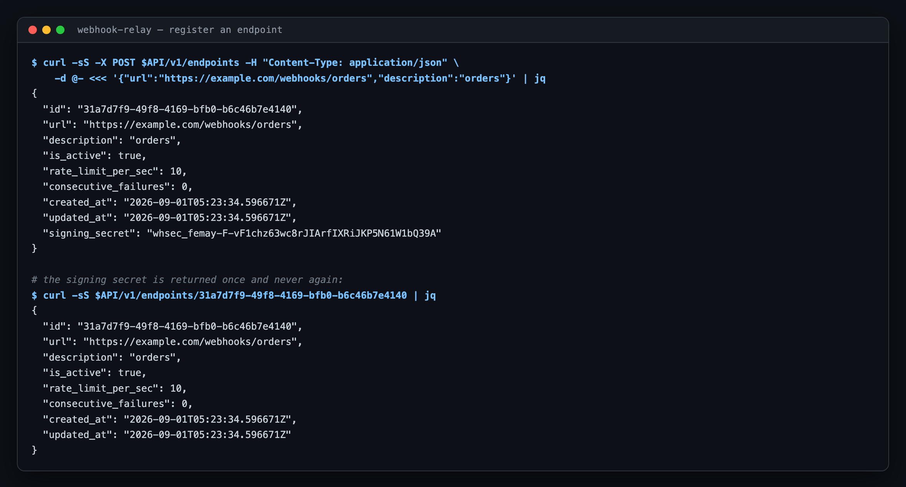
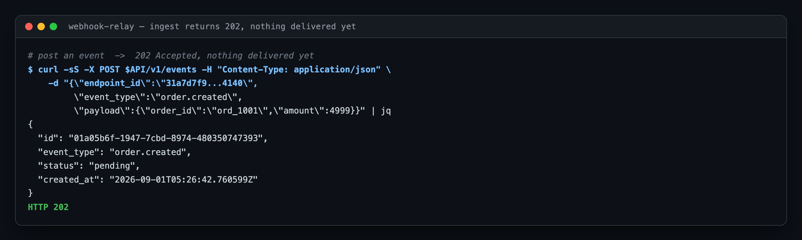
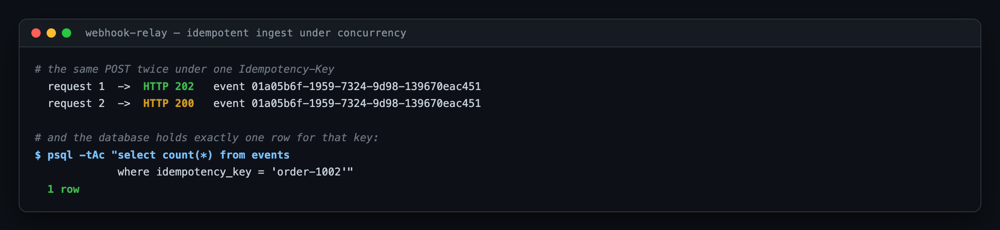
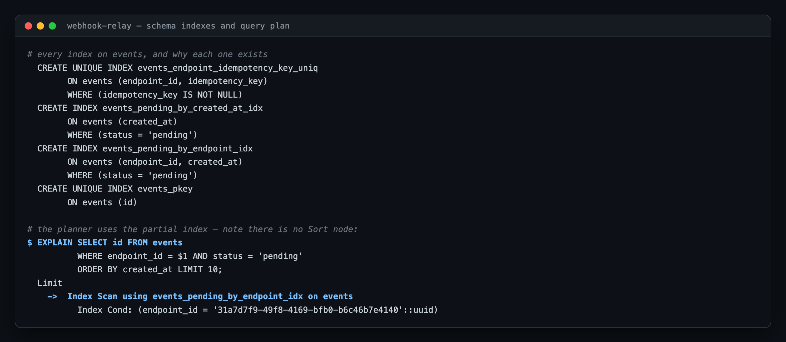
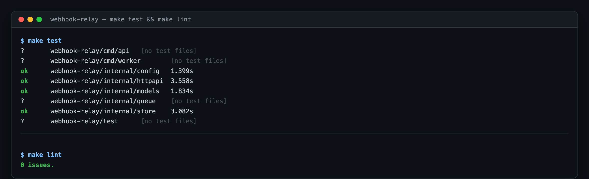

# webhook-relay

Reliable webhook delivery with at-least-once semantics, retries, and chaos-tested
failure modes — the kind of service Stripe or Svix runs internally.

[](https://github.com/singha105/webhook-relay/actions/workflows/ci.yml)
[](https://go.dev)
[](LICENSE)

---

## Status: Day 1 of 6

This repository is being built in public, one day at a time. **Only what is
described below actually works.** Nothing here is a stub presented as finished.

| | |
|---|---|
| ✅ **Working today** | Ingest API, endpoint management, Postgres persistence, idempotent ingest, migrations, local stack, CI |
| ⬜ **Not built yet** | Delivery. Events are persisted with status `pending` and **nothing sends them**. The worker binary starts, logs a warning that it has no delivery loop, and idles. |

The roadmap is at the [bottom of this file](#roadmap).

---

## Quick start

Requires only **Docker** and **make**. Everything else runs in containers.

```bash
git clone https://github.com/singha105/webhook-relay.git
cd webhook-relay
make up && make migrate-up
```



`make up` refuses to start if a host port is already taken, and tells you which
one and how to override it — ports live in `.env` (see `.env.example`). That is
deliberate: on the machine this was built on, 8080 belonged to Apache and 5432
to a local Postgres, and a bind error from inside Docker is a bad way to learn
that.

Then seed some data:

```bash
make seed
```

<details>
<summary><code>make</code> targets</summary>

| Target | What it does |
|---|---|
| `up` / `down` | Start / tear down the stack (`down` also deletes volumes) |
| `migrate-up` / `migrate-down` | Apply / roll back migrations |
| `seed` | Register a demo endpoint and post a few events |
| `test` / `test-short` | Full suite (needs Docker) / unit tests only |
| `lint` / `fmt` / `vet` | golangci-lint, formatting, vet |
| `verify` | Everything CI runs |
| `scan` | Scan the whole git history for secrets |

</details>

---

## What it does today

### Register an endpoint

The signing secret is generated server-side and returned **exactly once**. It is
never included in any subsequent response.



The secret is stored in plaintext rather than hashed, because the delivery
worker has to recompute an HMAC over the payload at send time. Unlike a
password, it cannot be a one-way hash. "Shown once" is an API-surface guarantee,
enforced by the response shape and asserted by tests — not a storage guarantee.

### Ingest an event

Ingest does four things and no more: decode, validate, write one row, return.
No delivery work, no queue publish, no pre-flight lookup on the request path.



`202`, not `201` — the event is durably recorded, but nothing has been
delivered. Claiming `201 Created` would imply the work is done.

### Idempotent ingest

Replay the same `Idempotency-Key` and you get the original event back with a
`200` instead of a `202`. Ten concurrent identical requests produce exactly one
row.



This is resolved by the database, not the application. See
[the idempotency race](#the-idempotency-race) below.

---

## API

| Method | Path | Returns |
|---|---|---|
| `POST` | `/v1/endpoints` | `201` + the signing secret, once |
| `GET` | `/v1/endpoints` | `200` list (no secrets) |
| `GET` | `/v1/endpoints/{id}` | `200` or `404` |
| `PATCH` | `/v1/endpoints/{id}` | `200`, only the fields you send |
| `DELETE` | `/v1/endpoints/{id}` | `204`, cascades to events and attempts |
| `POST` | `/v1/events` | `202` accepted, or `200` on an idempotent replay |
| `GET` | `/v1/events/{id}` | `200` status + full attempt history |
| `GET` | `/healthz` | liveness — touches no dependency |
| `GET` | `/readyz` | readiness — pings Postgres |

Every error uses one envelope, so a client writes one error handler:

```json
{
  "error": {
    "code": "validation_failed",
    "message": "the request body failed validation",
    "fields": [
      { "field": "url", "message": "must use http or https scheme" },
      { "field": "rate_limit_per_sec", "message": "must be between 1 and 1000" }
    ],
    "request_id": "b291971c-96e2-43f5-acf0-c44847eab9ce"
  }
}
```

Validation reports **every** broken field at once, so fixing a bad request does
not take one round trip per mistake. The `request_id` matches the one on every
log line for that request, and is echoed in the `X-Request-ID` response header.

---

## Design decisions

The parts worth arguing about, and what each one costs.

### The idempotency race

Ingest never does `SELECT`-then-`INSERT`. That pattern has a window between the
two statements where a concurrent request can insert the same key, and closing
it in application code needs a distributed lock nobody wants on the hot path.

Instead the `INSERT` runs unconditionally against a partial unique index and
Postgres arbitrates:

```sql
INSERT INTO events (id, endpoint_id, event_type, payload, idempotency_key)
VALUES ($1, $2, $3, $4, $5)
ON CONFLICT (endpoint_id, idempotency_key) WHERE idempotency_key IS NOT NULL
DO UPDATE SET idempotency_key = events.idempotency_key
RETURNING ...
```

`DO UPDATE`, not `DO NOTHING`, even though the update writes the key back to
itself. `DO NOTHING` returns zero rows on conflict, which forces a follow-up
`SELECT` that may run *before the winning transaction has committed* — the race
just moves one statement later. `DO UPDATE` takes the row lock, waits for the
winner, and hands back the surviving row.

**What it costs:** one dead tuple per duplicate, for vacuum to reclaim.

"Was it created?" is answered by comparing the returned ID to the UUIDv7 we
generated — the database can only return our ID if our insert was the one that
landed. That avoids the `xmax = 0` trick and its dependence on a system column.

### UUIDv7 for event IDs

The leading 48 bits are a Unix millisecond timestamp, so IDs sort in creation
order. Primary-key inserts append at the right edge of the B-tree instead of
scattering random pages, and the PK doubles as a rough time index.

**What it costs:** an event ID leaks its creation time. For a webhook event that
is not sensitive; for a user-facing resource ID it might be.

### Indexes are argued for, individually

This is a write-heavy path, so every index is amplification paid on each insert.
All four are justified inline in [`migrations/000001_init.up.sql`](migrations/000001_init.up.sql),
along with three indexes deliberately *not* created and why.



The partial index on `(endpoint_id, created_at) WHERE status='pending'` is the
interesting one. The equality column leads so `created_at` supplies the
`ORDER BY` — the plan above has no `Sort` node, so `LIMIT` short-circuits it.
Being partial means the index tracks the size of the *backlog* rather than
lifetime event volume: a delivered event drops out of it entirely.

### Valkey Streams over a LIST — and over Postgres SKIP LOCKED

Day 1 ships `queue.Queue` as an interface with no implementation, because
nothing consumes events yet and there is no behaviour to get wrong. The
reasoning is recorded in [`internal/queue/queue.go`](internal/queue/queue.go):

- **Not a LIST**, because a `LPOP` hands the job to a worker that might die
  holding it, and the job is then simply gone. That breaks at-least-once, which
  is the entire promise of this service. Streams keep a pending-entries list per
  consumer group, so an unacknowledged job can be reclaimed with `XAUTOCLAIM`.
- **Not Postgres `SELECT ... FOR UPDATE SKIP LOCKED`**, though it is genuinely
  tempting — it would drop Valkey entirely and make enqueue transactional. It
  loses because polling burns a connection per worker per poll, and it puts
  queue depth on the same disk as the durable event log, which is the last thing
  we want to saturate under load.

Day 6's benchmark is the honest test of that call. The interface is the seam
that makes reversing it cheap.

### Migrations are an operator action

`make migrate-up` runs the official `golang-migrate` image as a compose service.
Migrations deliberately do **not** run at application startup: several replicas
racing to migrate during a rolling deploy is a well-known way to deadlock one.

The `.sql` files are the single source of truth shared with the integration
tests, so the two paths cannot drift.

### Liveness and readiness are not the same probe

`/healthz` touches no dependency. A liveness probe that checked Postgres would
restart every API pod during a database blip, turning a recoverable outage into
a cluster-wide crash loop that also drops in-flight requests. `/readyz` pings
Postgres and pulls the pod out of the Service without killing it.

---

## Testing



Integration tests run against **real Postgres in a container** via
testcontainers-go. There are no database mocks, because most of what is worth
testing in the store layer *is* database behaviour — `CHECK` constraints,
`ON CONFLICT` arbitration, cascade deletes, and transaction visibility. A mock
would only assert that our fake behaves like our fake.

One container is shared per test binary; each test gets its own schema, so tests
run in parallel without seeing each other's rows.

### The race test was verified by mutation

A concurrency test that passes proves nothing unless it can fail. Swapping the
`ON CONFLICT` insert for the naive `SELECT`-then-`INSERT` makes it fail exactly
as it should:

```
--- FAIL: TestCreateEventIdempotencyRace (1.52s)
    goroutine 0: CreateEvent() = create event: ERROR: duplicate key value
    violates unique constraint "events_endpoint_idempotency_key_uniq"
    (SQLSTATE 23505) (a lost race must not surface as an error)
```

Getting there required fixing the test itself. `pgxpool` opens connections
lazily, so the first goroutine off the line completed its whole transaction
while the others were still finishing TCP handshakes — they never overlapped,
and the test passed the broken implementation too. Both race tests now pre-warm
their connection pools before the starting gate opens.

---

## Layout

```
cmd/api/          HTTP ingest + management API
cmd/worker/       delivery worker — no delivery loop yet (day 2)
internal/models/  domain types and validation; no I/O
internal/store/   Postgres access; owns every SQL statement
internal/queue/   queue interface; no implementation yet
internal/httpapi/ routing, middleware, handlers
internal/config/  environment-only configuration
migrations/       golang-migrate SQL, indexes justified inline
deploy/compose/   local stack: postgres 16, valkey 8, api
test/             testcontainers helpers
```

---

## Roadmap

| Day | Deliverable |
|---|---|
| **1** ✅ | Ingest API, schema, idempotency, local stack, CI |
| **2** | Delivery worker, Valkey Streams, HMAC-SHA256 signatures |
| **3** | Exponential backoff with jitter, per-endpoint circuit breaker, DLQ |
| **4** | OpenTelemetry → Prometheus, Tempo, Loki, Grafana |
| **5** | k3d + Helm + Terraform + ArgoCD; Chaos Mesh fault injection |
| **6** | k6 load test, benchmark numbers, and the postmortem |

`endpoints.consecutive_failures` already exists in the schema so Day 3's circuit
breaker is a code change rather than a migration against a populated table.

---

## Known gaps

Stated plainly rather than discovered by a reviewer:

- **No authentication.** Anyone who can reach the API can register endpoints and
  post events. Real deployments need API keys per tenant.
- **No SSRF protection.** Endpoint URLs may point at loopback and private
  ranges, which is required for local testing but would need an egress allowlist
  in a hosted deployment.
- **No rate limiting yet.** `rate_limit_per_sec` is stored and validated but not
  enforced; it governs delivery, which does not exist until Day 2.
- **Offset pagination** on `GET /v1/endpoints` drifts under concurrent inserts.
  Acceptable because endpoints are registered by humans, not by traffic. The
  events table would need keyset pagination.

## License

[MIT](LICENSE)
