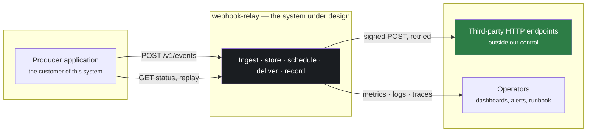
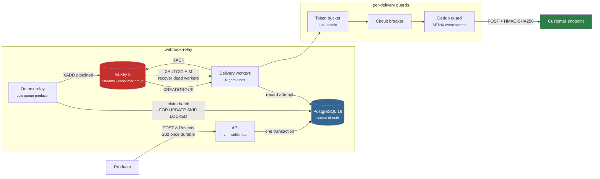
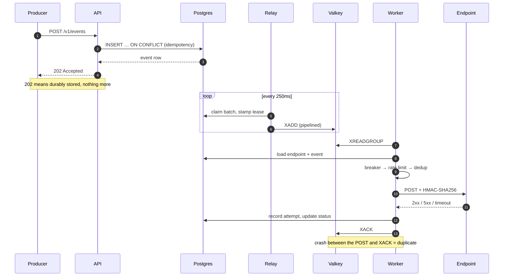

# High-level design

## System context

Who talks to what, and where the trust boundaries are.

The asymmetry is the whole design problem: we control everything inside the box
and nothing to the right of it. Receivers cannot be fixed, restarted, or
reasoned with — only accommodated.

## Component view

The shape that matters: **ingest never touches the queue.** It writes to
Postgres in one transaction and returns 202. A separate relay polls for due
events and is the only producer the queue has. That is the transactional outbox
pattern, and it is what makes the 202 mean something precise — "durably stored"
— rather than "probably stored and probably queued"
([ADR 0002](../docs/adr/0002-transactional-outbox.md)).

The dashed arrow is the one that makes the system survivable. When a worker
dies holding entries, `XAUTOCLAIM` hands them to a live worker after the stale
timeout. It is also the arrow that causes duplicate deliveries, which is what
the [postmortem](../docs/postmortem-duplicate-delivery.md) is about.

## Responsibilities

Each component has exactly one job, and the boundaries are enforced by what
each is *allowed to touch*.

| Component | Owns | Deliberately cannot |
|---|---|---|
| **API** (`cmd/api`) | Validation, idempotency, one transactional write, read APIs | Touch the queue, or perform any delivery work |
| **Outbox relay** (`internal/relay`) | Claiming due events, leasing, enqueueing, sweeping expired leases | Send HTTP to receivers |
| **Queue** (Valkey Streams) | Handing ready work to exactly one worker; tracking in-flight ownership | Be a system of record — it is a transport |
| **Worker pool** (`internal/worker`) | Guards, signing, the HTTP call, recording outcomes, acking | Invent work; it only processes what the relay produced |
| **Guards** (ratelimit, breaker, dedup) | Deciding whether *this* delivery may proceed right now | Persist anything that must survive Valkey loss |
| **Postgres** | Every fact that must survive a crash | — |

## Request lifecycle

## Deployment topology

Two independent paths, both committed, both runnable:

| | Local (`make demo`) | Kubernetes (`make demo-k8s`) |
|---|---|---|
| Orchestration | docker-compose | k3d cluster, Helm chart |
| Postgres | single container | CloudNativePG operator |
| Delivery | — | ArgoCD, pull-based ([ADR 0005](../docs/adr/0005-gitops-pull-over-push.md)) |
| Secrets | `.env`, gitignored | Sealed Secrets ([ADR 0006](../docs/adr/0006-sealed-secrets-over-cloud-kms.md)) |
| Scaling | fixed | HPA on CPU; queue-depth metric available but off |
| Status | **fully verified** | verified on the single-node profile ([#21](https://github.com/singha105/webhook-relay/issues/21)) |

## Design constraints and their consequences

| Choice | Bought | Cost |
|---|---|---|
| Outbox over dual-write | 202 means exactly one thing; queue loss is survivable | ≤250ms added latency; relay is a serial chokepoint |
| At-least-once | Never loses an accepted event | Receivers must dedupe on `X-Webhook-Id` |
| Valkey Streams over Kafka | No JVM, no ZooKeeper, one extra process | Single-threaded; depth metric untruthful above `MAXLEN` |
| Postgres as system of record | One place to look; trivially consistent | All delivery state transitions hit one primary |
| Per-endpoint rate limit | Protects receivers | Does **not** protect against one tenant monopolising workers |

## Scale characteristics

Measured on one laptop (see [Performance](../README.md#performance)): **~875 events/sec in,
~870/sec out**. The known limits, in the order they would bite:

1. **One shared queue** — a slow receiver occupies workers everyone else needs.
   The first thing to fix; see [What I would do differently](#what-i-would-do-differently-at-scale).
2. **The relay is serial** — sole producer for the whole system. Batching its
   enqueues bought 5.4%; it remains a single point of throughput.
3. **A single Postgres primary** absorbs every state transition.
4. **An unidentified serialization point** — 5× the workers buys 7% on an
   unsaturated machine ([#6](https://github.com/singha105/webhook-relay/issues/6)).

---

## Scale and trade-offs

### What I would do differently at scale

Everything below is deliberately *not* built. This system targets a single node
and hundreds of events per second; each of these is the right answer at a scale
it does not have, and building them now would be architecture cosplay.

**Partition the queue by endpoint.** One stream and one consumer group means a
single slow receiver occupies workers that everyone else is waiting for — the
noisy-neighbour problem, and the most urgent item here. A receiver that takes
9s per request ties up a worker for 9s, and with concurrency 10 it takes ten
such receivers to stall the system entirely. Partitioning by `endpoint_id` hash
into per-partition consumer groups bounds the damage to one partition. The cost
is rebalancing when endpoints are added, and hot partitions when one customer
dwarfs the rest.

**Separate worker pools per priority tier.** Password resets and marketing
webhooks currently share a queue. They should not: one is user-visible and
latency-critical, the other can wait minutes. Separate pools with separate
concurrency budgets stop a bulk backfill from delaying a login email. The cost
is capacity planning per tier and deciding what happens when the high-priority
pool is idle while the low one is saturated.

**Move the outbox relay to CDC via Debezium.** The relay polls every 250ms,
which adds latency to every event and puts a floor under how fresh delivery can
be. Debezium reading the Postgres WAL turns that into a push: the event is in
the queue milliseconds after commit, with no polling and no lease bookkeeping.
It also removes the relay as a serialization point entirely. The cost is
Kafka Connect, a Kafka cluster, and replication-slot management — a large
operational commitment, which is exactly why it is not here at this size.

**Shard Postgres by endpoint.** One primary handles ingest and every delivery
state transition. At ~10× current write volume the delivery-attempt table
becomes the constraint long before ingest does. Sharding by `endpoint_id` keeps
each endpoint's events and attempts colocated, so no query needs a scatter-gather.
The cost is that cross-shard operations — global dead-letter listings, aggregate
metrics — become fan-out queries, and resharding is a project rather than a
config change.

**Per-tenant fair queueing.** Rate limiting is per-endpoint, which protects
*receivers* and does nothing to stop one tenant consuming all delivery capacity.
A tenant posting a million events monopolises the workers no matter how polite
each individual delivery is. Weighted fair queueing or deficit round-robin
across tenant queues fixes it. The cost is that fairness needs a scheduler, and
a scheduler needs to know tenant weights, which is a product decision before it
is an engineering one.

---

---

**Previous:** [Problem statement](01-problem-statement.md) · **Next:** [Low-level design →](03-low-level-design.md)
