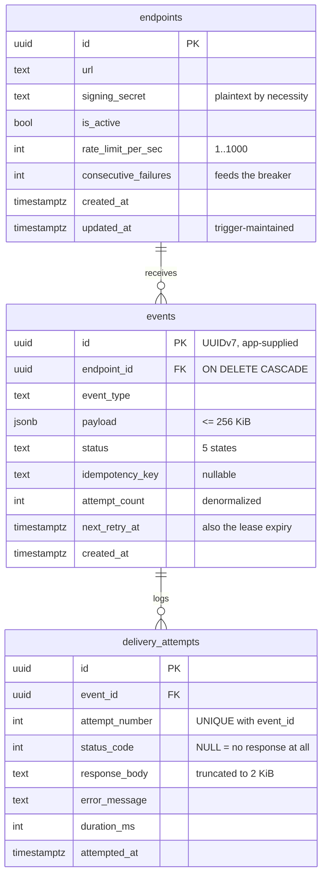
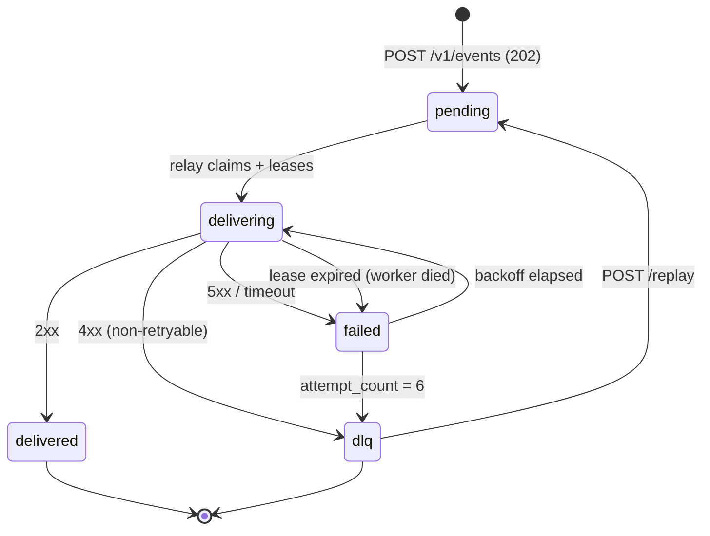

# Low-level design

The HLD says what the components are. This says how they are actually built —
schema, contracts, key formats, and the algorithms. Everything here is
verifiable against the code; file references are given throughout.

## Data model

Three tables. Every column earns its place, and every index is argued for
individually in [`migrations/000001_init.up.sql`](../migrations/000001_init.up.sql).



**Three columns worth explaining.**

`signing_secret` is stored in plaintext, not hashed. Unlike a password it must
be *recomputed* against at send time, so a one-way hash is impossible. The
"shown once" guarantee is enforced at the API boundary instead — the field is
tagged `json:"-"` so it can never be serialised into a response after creation.

`next_retry_at` does two jobs. For `pending`/`failed` events it means "do not
deliver before this time". For `delivering` events it is a **lease expiry** —
if a worker dies and the queue entry is lost too, the expired lease is what
lets the relay notice and requeue. One column, `NOT NULL` with a `now()`
default, so `ORDER BY` is served straight from an index with no `COALESCE`.

`status_code` is nullable, and the NULL is meaningful: it means no HTTP
response existed at all (timeout, refused, DNS). That distinction is load-bearing
for retry classification — and collapsing timeout and refused into the same NULL
is a known shortcoming ([#16](https://github.com/singha105/webhook-relay/issues/16)).

## Indexes

| # | Index | Serves | Why partial |
|---|---|---|---|
| 1 | `(endpoint_id, idempotency_key) WHERE key IS NOT NULL` | Idempotency — a **correctness** constraint, not a speed one | Most events carry no key |
| 2 | `(next_retry_at) WHERE status IN (pending, failed, delivering)` | The relay's global claim + lease sweep | Tracks the *backlog*, not lifetime volume |
| 3 | `(endpoint_id, next_retry_at) WHERE status IN (…)` | Per-endpoint operator queries | Same |
| 4 | `UNIQUE (event_id, attempt_number)` | Attempt numbering idempotency **and** the read path for `GET /v1/events/{id}` | — |

Deliberately **not** indexed: `status` alone (five distinct values — the planner
would seq-scan anyway), `payload` (GIN is the most expensive index to maintain
on write, and this is the write path), `event_type` (no query filters on it yet).

## Event state machine



`delivered` and `dlq` are the only terminal states, and both are reachable via
the API. There is no state in which an event is unaccounted for.

## API contracts

Ingest — the only endpoint on the hot path:

```http
POST /v1/events
Content-Type: application/json
Idempotency-Key: order-4471        # optional, scoped per endpoint

{ "endpoint_id": "...", "event_type": "order.created", "payload": { ... } }
```

| Response | Meaning |
|---|---|
| `202 Accepted` | Durably committed to Postgres. **Not** queued, not delivered. |
| `200 OK` | Idempotency key replay — returns the original event |
| `400` | Malformed JSON |
| `413` | Request body too large |
| `422` | Valid JSON, invalid fields — **including an unknown `endpoint_id`** |

`202` rather than `201` is deliberate: `201 Created` would imply the work is
done. An unknown `endpoint_id` is `422` rather than `404` for the same kind of
precision — the URL was correct, it is the *body* that references something
that does not exist. Errors use one envelope everywhere — `{"error": {"code", "message",
"fields", "request_id"}}` — so a client parses one shape.

## Delivery request

What a receiver actually sees:

```http
POST /their/path
Content-Type: application/json
User-Agent: webhook-relay          # configurable
X-Webhook-Id: 01a0683c-ccb9-74ae-b046-cec48225323d
X-Webhook-Timestamp: 1788564742
X-Webhook-Signature: t=1788564742,v1=94ddf64fbdcc3428d8...
X-Webhook-Attempt: 3
```

`X-Webhook-Id` is **stable across every retry** — it is the receiver's
deduplication key, and the contract in [ADR 0004](../docs/adr/0004-at-least-once-over-exactly-once.md)
depends on it. `X-Webhook-Attempt` is informational; receivers must not treat
attempt 1 differently.

## Signing algorithm

```
signature = HMAC-SHA256(secret, "{unix_timestamp}.{raw_request_body}")
header    = "t={unix_timestamp},v1={hex(signature)}"
```

Three details that are each a vulnerability if skipped:

- **The timestamp is inside the signed payload**, not merely alongside it.
  Otherwise a captured request replays forever with a valid signature.
- **The raw body is signed**, before any parsing or re-serialisation. Re-encoding
  JSON can reorder keys and invalidate an otherwise-correct signature.
- **Comparison is constant-time** (`hmac.Equal`). A byte-by-byte compare that
  short-circuits leaks the correct signature one byte at a time under timing
  analysis.

Verification is published as an importable package,
[`pkg/webhook`](../pkg/webhook/) — the one package at **100% coverage**, because a
bug there is a bug in someone else's codebase.

## Retry policy

```
delay = U(0, min(cap, base × 2^attempt))     base 1s · cap 1h · 6 attempts
```

Full jitter — a uniform draw over the *whole* interval, not a perturbation
around the exponential value ([ADR 0003](../docs/adr/0003-full-jitter-backoff.md)).

| Receiver response | Classification | Action |
|---|---|---|
| `2xx` | success | mark delivered, reset `consecutive_failures` to 0 |
| `429`, `503` + `Retry-After` | retryable | honour the header if it is sane |
| `5xx` | retryable | backoff, increment failures |
| `4xx` (other) | **permanent** | straight to DLQ — retrying an identical request cannot help |
| timeout / refused / DNS | retryable, `status_code = NULL` | backoff |

Redirects are **not** followed: a 301 to a different host would send a signed
payload somewhere the customer never registered.

## Valkey key layout

Every key is namespaced by purpose, and none of them is a system of record —
all of this can be lost without losing an event.

| Key | Type | Purpose | TTL |
|---|---|---|---|
| `webhook-relay:deliveries` | Stream | The work queue, trimmed `MAXLEN ~ 100000` | — |
| `delivery:{event_id}:{attempt}` | String (SETNX) | Dedup guard — one dispatch per attempt | 15 min |
| `ratelimit:endpoint:{id}` | Hash | Token bucket state | idle expiry |
| `breaker:endpoint:{id}` | String | Consecutive-failure state | cooldown |
| `breaker:probe:{id}` | String (SETNX) | Ensures exactly **one** half-open probe | cooldown |

All workers join a single consumer group, `delivery-workers`, so each entry goes
to exactly one worker rather than being fanned out to all of them.

The dedup key is `(event_id, attempt)`, not `event_id` — which is precisely why
it cannot help with the timeout case: a timeout produces a legitimately *new*
attempt number ([postmortem](../docs/postmortem-timeout-boundary.md)).

## Concurrency model

| Mechanism | Where | Guarantees |
|---|---|---|
| `INSERT … ON CONFLICT DO UPDATE` | ingest | Idempotency under concurrent identical requests, resolved by the DB |
| `FOR UPDATE SKIP LOCKED` | relay claim | Several relay replicas take **disjoint** batches without coordinating |
| Consumer group + `XAUTOCLAIM` | queue | One worker per entry; dead workers' entries recovered after 60s |
| Lease in `next_retry_at` | relay sweep | Second recovery path if the queue *itself* is lost |
| Lua script (atomic) | rate limit, breaker probe | Check-and-decrement cannot interleave between replicas |

Two independent recovery paths is not redundancy for its own sake. `XAUTOCLAIM`
recovers a dead *worker*; the lease sweep recovers a dead *queue*. Neither
covers the other's failure.

Worker concurrency is `WORKER_CONCURRENCY` goroutines, each processing its
claimed batch **serially** — so in-flight parallelism equals that number, and
batch size only reduces round trips. That number is also, exactly, the number of
duplicates one crash produces ([#10](https://github.com/singha105/webhook-relay/issues/10)).

## Configuration

Every knob, its default, and what raising it costs.

| Variable | Default | Effect of raising |
|---|---|---|
| `WORKER_CONCURRENCY` | 10 | More throughput — **and a proportionally larger duplicate blast radius** |
| `DB_MAX_CONNS` | 10 | Must exceed concurrency; workers and the relay share one pool |
| `RELAY_POLL_INTERVAL` | 250ms | Lower = less latency, more idle queries |
| `RELAY_BATCH_SIZE` | 100 | Larger batches, fewer round trips, coarser lease granularity |
| `MAX_ATTEMPTS` | 6 | Longer before DLQ |
| `RETRY_BASE_DELAY` / `RETRY_MAX_DELAY` | 1s / 1h | The backoff curve |
| `DELIVERY_TIMEOUT` | 10s | Longer patience; see the [timeout-boundary postmortem](../docs/postmortem-timeout-boundary.md) |
| `DELIVERY_LEASE` | 5m | How long before a stuck `delivering` event is requeued |
| `STALE_CLAIM_TIMEOUT` | 60s | How long before a dead worker's entry is reclaimed |
| `DELIVERY_DEDUP_TTL` | 15m | Must exceed the reclaim window, or the guard misses |
| `BREAKER_THRESHOLD` / `BREAKER_COOLDOWN` | 10 / 5m | When to stop calling a failing endpoint |

## Failure modes, by component

| What dies | Detected by | Recovery | Events lost |
|---|---|---|---|
| A worker, mid-delivery | `XAUTOCLAIM` after 60s | Another worker takes the entry | **0** — but duplicates without the guard |
| The whole worker pool | Backlog age alert | Restart; queue is untouched | **0** (verified: 730 events, 0 lost) |
| Valkey (total loss) | Workers see `NOGROUP` | Group recreated; relay re-enqueues from Postgres | **0** (verified: 200/200) |
| The relay | Lease expiry | Another replica claims; leases expire naturally | **0** |
| Postgres primary | CNPG | Failover; writes resume | **0** (untested — needs 3 replicas) |
| A receiver | Consecutive failures | Breaker opens, retries back off, then DLQ | **0** — dead-lettered, not dropped |

---

---

## Known limitations

Named here rather than left for a reviewer to find.

- **Events stranded in `delivering` after a worker dies.** When the dedup guard
  suppresses a re-dispatch, the worker acks the queue entry without recording an
  outcome, so the event sits in `delivering` until the lease sweep and the dedup
  TTL let it through. Found by `make demo` on Day 6, not by a test.
  [#19](https://github.com/singha105/webhook-relay/issues/19)
- **`/readyz` reports ready with no schema.** It checks that Postgres is
  reachable, not that migrations have run, so a freshly deployed pod passes its
  health check and then 500s every request.
  [#18](https://github.com/singha105/webhook-relay/issues/18)
- **A serialization point in delivery is unidentified.** 5× the worker
  concurrency buys 7% on a machine where nothing is CPU-saturated.
  [#6](https://github.com/singha105/webhook-relay/issues/6)
- **Half the chaos experiments have not run** — five of eleven need Chaos Mesh or
  a multi-replica Postgres. Predictions are committed and unresolved.
- **The Kubernetes path is not verified end to end.** At 5 GiB of Docker memory
  the cluster gets much further than it used to: Chaos Mesh, ArgoCD, and a
  3-replica CloudNativePG cluster all reach `Running`, and `helm_release.argocd`
  completes in 1m35s once the timeouts are raised. The api and worker pods then
  crashloop because they cannot reach the Postgres service IP, despite CNPG
  reporting `3/3 ready` with a valid endpoint on the `-rw` service. That is a
  cluster networking failure under memory pressure rather than an application
  bug, and it is unresolved. `make demo` therefore runs the Compose stack, which
  **is** verified from a clean clone.
- **No authentication.** Anyone who can reach the API can register endpoints and
  post events. Real deployments need per-tenant API keys.
- **No SSRF protection.** Endpoint URLs may point at loopback and private
  ranges — required for local testing, unacceptable hosted without an egress
  allowlist.
- **No list/filter endpoint for events.** Only get-by-id. Operational queries go
  through psql, which is why `make demo` shells into Postgres for its counts.
- **`endpoint_id` is a metric label** — one series per endpoint on four metrics.
  Fine at tens of endpoints, a cardinality problem at thousands.
- **Delivery is at-least-once, deliberately.** See [Delivery
  semantics](../README.md#delivery-semantics).
- **`payload: null` is accepted** and delivered as the four bytes `null`, since
  it is valid JSON. [#7](https://github.com/singha105/webhook-relay/issues/7)
- **NetworkPolicies were missing a rule for Postgres.** k3s *does* enforce
  NetworkPolicy — it ships a kube-router-based controller, so an earlier note
  here claiming Flannel made them inert was wrong. With enforcement working, the
  namespace default-deny firewalled the database off from the application
  entirely, because the datastores policy selected only Valkey's labels and
  CloudNativePG pods carry `cnpg.io/*`. Fixed; found by rebuilding from scratch.
- **The HPA's queue-depth metric is disabled by default.** It needs
  prometheus-adapter, which is not installed. An HPA referencing a metric nobody
  serves is a silently degraded autoscaler, so it is off rather than aspirational.
- **Grafana runs with anonymous admin access** in the Compose stack. Correct for
  a local demo, not something to deploy; the Kubernetes path uses a generated
  password.
- **Tracing samples at 100%.** Right at this volume, wrong for real traffic.
- **The breaker can overshoot its threshold** — concurrent goroutines can push
  `consecutive_failures` past the limit before the open takes effect. Deliberate:
  an exact trip would need a lock on the hot path. The *probe* is exact.
- **Offset pagination** on `GET /v1/endpoints` drifts under concurrent inserts.
  Endpoints are registered by humans, so this is acceptable; the events table
  would need keyset pagination.
- **Queue depth stops being truthful above 100,000.** The stream is trimmed at
  `MAXLEN ~ 100000`, so the gauge pins there and stops counting.

---

---

**Previous:** [High-level design](02-high-level-design.md) · **Up:** [Index](README.md)
