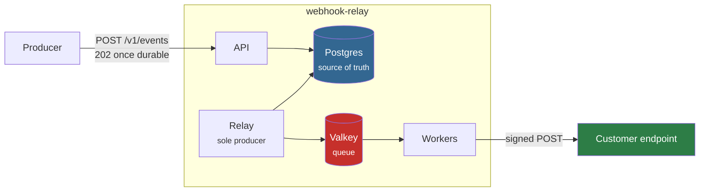

# System design

The design documents for webhook-relay, written in the order you would write
them: what problem exists, what shape the system takes, then how each piece is
actually built.

The [root README](../README.md) is the front door — what this is, how to run
it, and the measured results. These are the reference documents behind it.

| | Document | Answers |
|---|---|---|
| **01** | [Problem statement](01-problem-statement.md) | What problem is this solving, for whom, and what is explicitly out of scope? |
| **02** | [High-level design](02-high-level-design.md) | What are the components, what is each responsible for, and where does it break first? |
| **03** | [Low-level design](03-low-level-design.md) | What exactly is stored, what does a receiver see, what does every dial cost? |

## The one-paragraph version

An application needs to tell someone else that something happened, over a
network that loses messages, to a server it does not control and cannot fix.
webhook-relay accepts an event, stores it durably before acknowledging, and
then owns delivery: signing, retrying with full-jitter backoff, pacing itself
per receiver, giving up in a controlled and visible way, and keeping an audit
trail of every attempt. It delivers **at-least-once** — never losing an
accepted event, occasionally delivering one twice — because
[exactly-once is provably impossible](../docs/adr/0004-at-least-once-over-exactly-once.md)
over a lossy channel.

**Ingest never touches the queue.** It writes to Postgres in one transaction
and returns 202. A separate relay is the queue's only producer. That is the
transactional outbox, and it is why the queue can be destroyed without losing
an event — [verified by doing exactly that](../docs/chaos-results.md).

## Related reading

These sit alongside the design documents rather than inside them, because they
record *decisions* and *evidence* rather than structure.

| | |
|---|---|
| [Architecture decision records](../docs/adr/) | Six decisions, each with what it costs — not just what it buys |
| [Postmortem: duplicate deliveries](../docs/postmortem-duplicate-delivery.md) | The design's central trade-off, measured under a real failure |
| [Postmortem: the timeout boundary](../docs/postmortem-timeout-boundary.md) | Where sender-side guarantees run out |
| [Chaos results](../docs/chaos-results.md) | Eleven experiments, predictions committed before each run |
| [Load testing](../loadtest/README.md) | The measured numbers, and three experiments that measured nothing |
| [Runbook](../docs/runbook.md) | What to do when it breaks at 3am |

## A note on how these are written

Every design document here states what its decisions **cost**, not only what
they buy. A document listing only advantages is advertising, and the sections
worth reading are the ones admitting that the relay is a serialization point,
that the queue-depth metric stops being truthful above its cap, and that one
slow receiver can still starve the others.

Where something is unverified, it says so.
